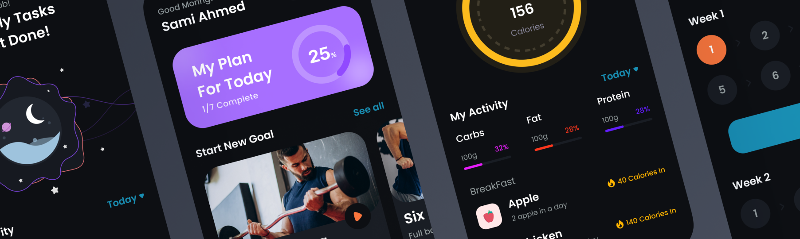

# Fit Boost 💪🏻

Fit Boost is a health and fitness app that helps users achieve their fitness goals by providing personalized workout and meal plans.

## Features

- Personalized dashboard
- Workout tracking
- Meal planning
- Progress tracking
- Social sharing
- Reminders and notifications

## Technologies Used

- Laravel for the backend API
- PostgreSQL for the database

## Installation

1. Clone the repository to your local machine.
2. Run `composer install` to install Laravel dependencies.
3. Create a new database and configure the `.env` file with your database credentials.
4. Run `php artisan migrate` to create the database tables.

## Documentation

Please refer to the [Fit Boost API documentation](documents/api.md) for detailed instructions on how to use the app.

## Contributing

1. Fork the repository.
2. Create a new branch for your feature.
3. Make your changes and commit them with clear commit messages.
4. Submit a pull request to the `master` branch.

## License

This project is licensed under the MIT License - see the LICENSE file for details.
